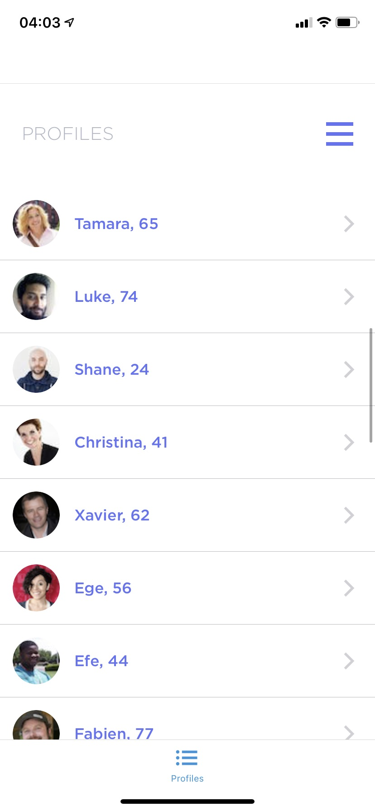
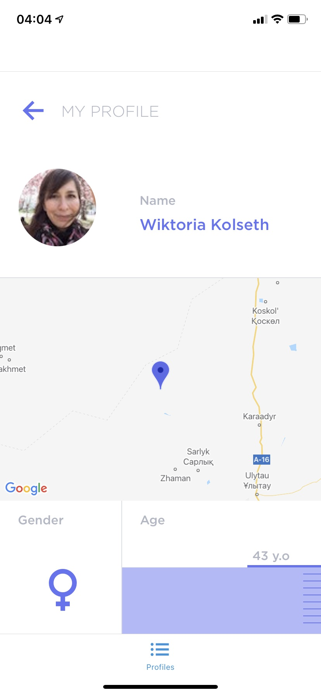
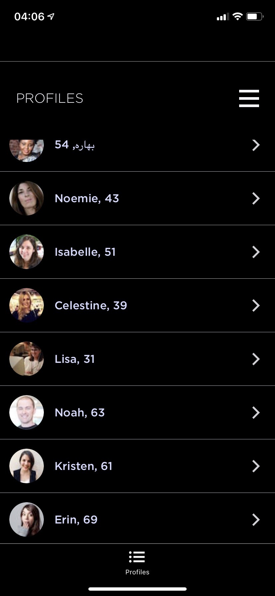
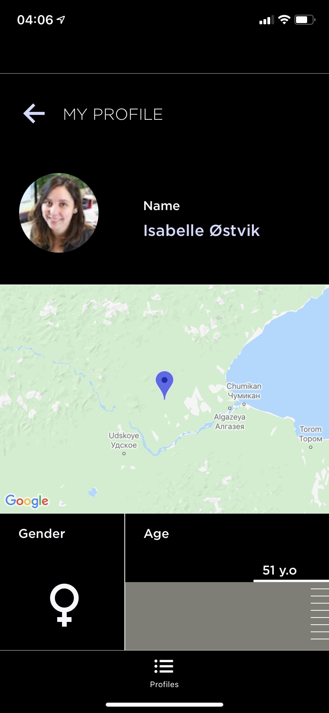

# Case Study with React Native

## Application Setup

The application was created with create-react-native-app and requires only `npm install` and `npm start` to get it installed and launched.
App is availabe in this expo [link](https://expo.io/@ozkanabd/case-study)

## Screenshots

Light Theme Profile List

Light Theme User Profile

Dark Theme Profile List

Dark Theme User Profile

